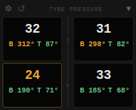
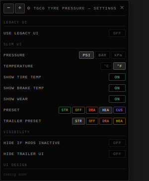

# TGCG Tire Pressure Monitor

A TPMS-style in-game UI app for BeamNG.drive that displays real-time tire pressure, temperature, and wear for any vehicle — including trucks with dual-rear wheels and multi-trailer setups.

---

## v2.0 — New Features

### Slim UI (New Default)
A redesigned compact layout that strips the header buttons down to just a gear icon and minimize. Pressure is the primary value per wheel, with tire temperature and brake temperature shown inline below it.

### Settings Panel
A floating, draggable settings panel accessible via the ⚙ gear icon. Drag it anywhere on screen; position and zoom scale are saved between sessions.

**Available settings:**
- **UI Mode** — Switch between new Slim UI and Legacy UI
- **Pressure unit** — PSI / BAR / kPa (default: PSI)
- **Temperature unit** — °F / °C (default: °F)
- **Show Tire Temp** — Toggle tire surface temperature display (requires Node Based Tire Wear mod)
- **Show Brake Temp** — Toggle brake temperature display per wheel
- **Show Wear** — Toggle wear bar per wheel (requires Node Based Tire Wear mod)
- **Preset** — Warn/crit thresholds: Street, Offroad, Drag, Heavy, Custom
- **Custom Preset** — Set your own warn and critical PSI thresholds
- **Trailer Preset** — Independent threshold preset for trailer wheels
- **Hide If Mods Inactive** — Hides the app when neither the RaceTab Tyre Inflator nor the Node Based Tire Wear mod is equipped on the current vehicle
- **Hide Trailer UI** — Suppress the trailer section even when a trailer is coupled
- **Settings panel zoom** — `−` / `+` buttons in the settings header to scale the panel up or down

### Brake Temperature
Each wheel tile now shows brake surface temperature alongside tire temperature, with the same colour-coded heat scale (green → amber → red).

### Per-Vehicle Preset Memory
Pressure presets are saved per vehicle. Swap between your D-Series and your ETK and each remembers its own preset.

### Multi-Trailer Chain Support
Full detection and display for multi-trailer setups, including disconnect detection across the chain.

### Manual Refresh Button
The `↺` button now triggers a full wheel re-detection pass — useful after coupling/uncoupling trailers or swapping vehicle configs mid-session.

---

## v1.0 — Original Features

- Real-time pressure, temperature, and wear per wheel
- Auto-detects wheel count and axle layout for any vehicle
- Dual-rear wheel support with inner/outer labeling
- Trailer detection with separate collapsible trailer section
- Pressure units: PSI / BAR / kPa
- Temperature units: °C / °F
- Tire presets: Street, Drag, Off-Road, Heavy — with color-coded indicator
- Warn (amber) and critical (red) highlights for low pressure or high temp
- Wear bar per wheel (requires [Node Based Tire Wear](https://www.beamng.com/resources/node-based-tire-wear.36502/))
- Collapsible sections for clean screen real estate

---

## Installation

1. Download the latest release zip from the [Releases](../../releases) page
2. Place the zip directly into your BeamNG mod folder (`Documents\BeamNG.drive\mods\`)
3. Launch BeamNG.drive — the mod will load automatically
4. Open the **Apps** panel and add **TGCG Tire Pressure** to your layout

---

## Usage

### Slim UI (v2 default)
- **⚙** — Open the settings panel
- **↺** — Force re-detect wheels (use after coupling a trailer or changing configs)
- **▼ / ▶** — Collapse / expand the main or trailer section

### Legacy UI
- **▼ / ▶** — Collapse/expand the main or trailer section
- **PSI / BAR / kPa** — Cycle pressure units
- **°C / °F** — Cycle temperature units
- **↺** — Force refresh wheel detection
- **Preset button** — Cycle tire pressure presets (STREET / DRAG / OFFROAD / HEAVY)

---

## Optional Dependencies

| Mod | What it enables |
|---|---|
| [Node Based Tire Wear](https://www.beamng.com/resources/node-based-tire-wear.36502/) | Tire surface temperature + wear bar |
| [RaceTab Tyre Inflator](https://www.beamng.com/resources/) | "Hide If Mods Inactive" detection |

Both are optional — the app works without them, and features dependent on a missing mod are automatically greyed out in settings.

---

## Compatibility

- Any BeamNG.drive vehicle
- Trucks with dual-rear axles
- Vehicles with single or chained trailer setups
- Career mode (RLS)

---

## Author

**TGCG** — [GitHub](https://github.com/ThatGr8CdnGamer)
