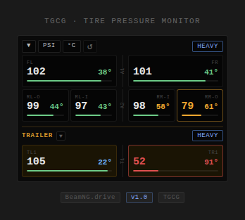

# TGCG Tire Pressure Monitor

A TPMS-style in-game UI app for BeamNG.drive that displays real-time tire pressure, temperature, and wear for any vehicle — including trucks with dual-rear wheels and multi-trailer setups.

---

## Features

- Real-time pressure, temperature, and wear per wheel (with per node tire damage mod: https://www.beamng.com/resources/node-based-tire-wear.36502/)
- Auto-detects wheel count and axle layout for any vehicle
- Dual-rear wheel support with inner/outer labeling
- Trailer detection with separate collapsible trailer section
- Pressure units: PSI / BAR / kPa (cycle with button)
- Temperature units: °C / °F (cycle with button)
- Tire presets: Street, Drag, Off-Road, Heavy — with color-coded indicator
- Warn (amber) and critical (red) highlights for low pressure or high temp
- Wear bar per wheel (with tire damage mod active on vehicle)
- Collapsible sections for clean screen real estate

---

## Installation

1. Download the latest release zip from the [Releases](../../releases) page
2. Place the zip directly into your BeamNG mod folder:
3. Launch BeamNG.drive — the mod will load automatically
4. Open the **Apps** panel and add **TGCG Tire Pressure** to your layout

---

## Usage

- **▼ / ▶** — Collapse/expand the main or trailer section
- **PSI / BAR / kPa** — Cycle pressure units
- **°C / °F** — Cycle temperature units
- **↺** — Force refresh wheel detection (useful after vehicle config changes, or if it gets stuck with a trailer in the UI)
- **Preset button** — Cycle tire pressure presets (STREET / DRAG / OFFROAD / HEAVY)

---

## Compatibility

- Any BeamNG.drive vehicle
- Trucks with dual-rear axles
- Vehicles with attached trailers (single and multi-trailer chains)

---

## Version

**v1.0** — Current release

---

## Author

**TGCG** — [GitHub](https://github.com/ThatGr8CdnGamer)
